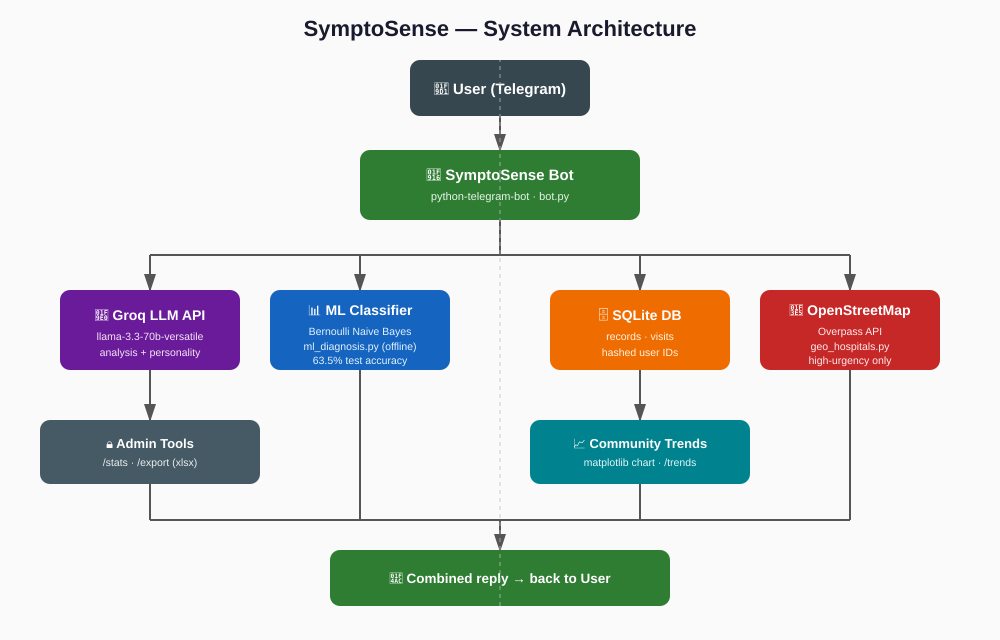

# 🏥 SymptoSense

**بوت تيليجرام ذكي لتحليل الأعراض الصحية وتوعية المستخدمين — مبني بلغة Python، يجمع بين نموذج لغوي كبير (LLM)، نموذج تعلم آلة مدرّب محلياً، وبيانات مجتمعية حية.**

> ⚠️ هذا المشروع لأغراض التوعية والتعليم فقط، ولا يُغني عن استشارة طبيب مختص.

---

## 📐 مخطط النظام (Architecture)



---

## ✨ الميزات

| الميزة | الوصف |
|---|---|
| 🧠 **تحليل ذكي بلغة طبيعية** | يجمع بيانات المريض (العمر، الجنس، الأعراض، المدة، الشدة) ويحلّلها عبر Groq LLM (`llama-3.3-70b-versatile`) |
| 💬 **شخصية تفاعلية** | كل رد يتضمن ملاحظة شخصية متعاطفة مبنية على حالة المريض تحديداً، مو نصوص جاهزة |
| 🕐 **ذاكرة عبر الوقت** | يقارن كل تحليل جديد بآخر زيارة لنفس المستخدم (تغير الشدة، تكرار الأعراض) |
| 📊 **رادار الأعراض المجتمعي** | إحصائيات حية (نص + رسم بياني) لأكثر الأعراض المُبلّغ عنها خلال آخر 7 أيام، من كل المستخدمين (بيانات مجهولة الهوية) |
| 🤖 **نموذج تعلم آلة حقيقي** | مصنّف Bernoulli Naive Bayes مدرّب على بيانات أعراض، يعطي احتمالات حقيقية لكل حالة (دقة اختبار: 63.5% — التفاصيل في [MODEL_CARD.md](./MODEL_CARD.md)) |
| 🏥 **إيجاد أقرب مستشفى** | بالحالات عالية الخطورة، يطلب موقع المستخدم (اختيارياً) ويبحث عن أقرب المستشفيات عبر OpenStreetMap |
| 🌙 **وعي بالوقت والعمر** | يراعي وقت الليل (نصائح راحة بدل الحث الفوري على الخروج) والفئة العمرية (طفل / مراهق / بالغ / كبير سن) بصياغة الرد |
| 💬 **أسئلة متابعة** | بعد كل نتيجة، يقدر المستخدم يسأل أسئلة حرة مبنية على حالته بالضبط |
| 📦 **تصدير بيانات** | أمر إداري `/export` يرسل كل البيانات المجهولة كملف Excel جاهز لـ Power BI |
| 📈 **إحصائيات استخدام** | أمر إداري `/stats` يعرض عدد الزوار والتحليلات المكتملة |
| 🌐 **ثنائي اللغة** | يدعم العربية والإنجليزية بالكامل |

---

## 🗂️ هيكل الملفات

```
SymptoSense/
├── bot.py                  # نقطة الدخول الرئيسية — منطق المحادثة وكل الميزات
├── db.py                   # طبقة قاعدة البيانات (SQLite) — سجلات، زيارات، اتجاهات
├── ml_diagnosis.py          # استدلال نموذج تعلم الآلة (بايثون خالص، بدون scikit-learn وقت التشغيل)
├── ml_model.json            # معاملات النموذج المدرّب (مُصدَّرة من train_model.py)
├── train_model.py           # سكربت تدريب النموذج (scikit-learn) — يُشغَّل مرة واحدة أوفلاين
├── geo_hospitals.py         # البحث عن أقرب مستشفى عبر OpenStreetMap Overpass API
├── requirements.txt         # مكتبات Python المطلوبة
├── MODEL_CARD.md             # توثيق رسمي لنموذج تعلم الآلة (البيانات، التقييم، الحدود)
└── README.md                 # هذا الملف
```

---

## ⚙️ الإعداد والتشغيل

### المتغيرات البيئية المطلوبة

| المتغير | الوصف |
|---|---|
| `TELEGRAM_BOT_TOKEN` | توكن البوت من [@BotFather](https://t.me/BotFather) |
| `GROQ_API_KEY` | مفتاح API من [console.groq.com](https://console.groq.com) |
| `ADMIN_TELEGRAM_ID` | معرّف تيليجرام الرقمي للمشرف (لأوامر `/stats` و `/export`) |
| `DB_PATH` | مسار قاعدة البيانات (استخدمي مساراً على Volume دائم بالإنتاج، مثل `/data/symptosense.db`) |
| `HASH_SALT` *(اختياري)* | نص عشوائي لتقوية تجهيل هوية المستخدمين بقاعدة البيانات |

### التشغيل محلياً

```bash
pip install -r requirements.txt
python bot.py
```

### النشر (مثال: Railway)

1. اربطي المستودع بمشروع Railway
2. أضيفي المتغيرات البيئية أعلاه من تبويب Variables
3. أرفقي **Volume** بمسار `/data` لضمان بقاء البيانات بين عمليات النشر
4. Railway ينشر تلقائياً عند أي `git push`

---

## 🤖 عن نموذج تعلم الآلة

مصنّف **Bernoulli Naive Bayes** مدرّب على بيانات اصطناعية مبنية على قاعدة معرفة طبية منسّقة (15 حالة شائعة، 12 عرض). التفاصيل الكاملة (منهجية البيانات، جدول التقييم الكامل لكل حالة، القيود، الاعتبارات الأخلاقية) موثّقة في [MODEL_CARD.md](./MODEL_CARD.md).

لإعادة تدريب النموذج:
```bash
python train_model.py
```

---

## 🔐 الخصوصية

- لا يتم تخزين أي هوية حقيقية — معرّف كل مستخدم يُحوَّل إلى **hash أحادي الاتجاه** قبل التخزين
- بيانات "رادار الأعراض المجتمعي" مجمّعة وغير قابلة لربطها بشخص معين
- مشاركة الموقع (لإيجاد أقرب مستشفى) اختيارية بالكامل ومستخدمة فقط لحظياً، غير مخزّنة

---

## 👤 عن المشروع

بُني بواسطة **ريماس السلمي** كمشروع يجمع بين تطوير البرمجيات وعلوم البيانات — من جمع البيانات وتدريب النموذج إلى النشر الإنتاجي الكامل.

للتواصل: [@rms_2o](https://t.me/rms_2o)
