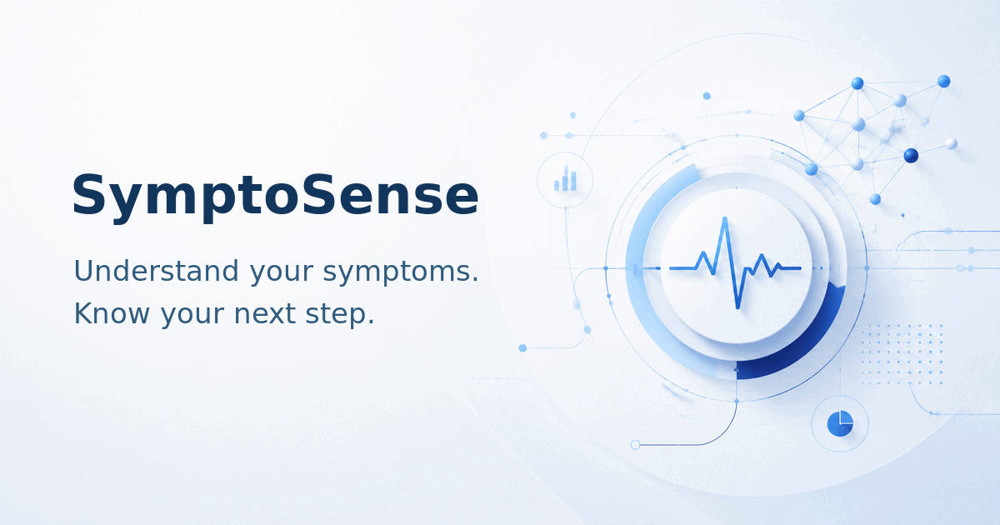

# SymptoSense 🩺

**Understand your symptoms. Know your next step.**

SymptoSense is a bilingual health-awareness web application created by **Remas Hameed Alsolami**, a Data Science and Analytics student. It brings symptom review, safety checks, explainable results, medication information, and trusted medical references into one calm, accessible experience.

> SymptoSense provides educational information and an initial assessment only. It is not a medical diagnosis and does not replace a qualified healthcare professional.



## About

The project explores how data science, artificial intelligence, and thoughtful product design can make health information easier to understand without presenting uncertain results as confirmed diagnoses.

The web application supports Arabic RTL and English LTR, works as a Progressive Web App, and separates public educational tools from private account features.

## Why I built it

SymptoSense began with a simple question: **How can technology feel closer to people?**

The goal is to provide a structured, calm starting point for people who want to understand symptoms, recognize warning signs, and identify an appropriate next step while keeping medical limitations visible.

## Core capabilities

- Symptom review with rule-based red-flag checks.
- Medical knowledge retrieval and explainable condition matching.
- Arabic and English health search.
- Medication information and private medication reminders.
- Educational blood-test explanations.
- Private health profile and analysis history.
- Trusted medical sources with official links.
- Role-protected administration and anonymized operational analytics.
- Installable PWA experience for supported mobile and desktop browsers.

Basic health search and symptom review are available to guests. Saving personal information, history, reminders, and account preferences requires authentication.

## How it works

```text
User input
  → Symptom normalization
  → Medical knowledge retrieval
  → Disease–symptom matching
  → Red-flag safety rules
  → AI-assisted explanation
  → Risk guidance, next steps, and sources
```

AI does not independently determine urgency, create official source links, or override safety rules. It is used to help explain structured results in clearer language.

## Medical safety

- Results use “possible conditions” language rather than confirmed diagnosis.
- Emergency red flags take priority over model confidence.
- Model outputs are not presented as confirmed disease probabilities.
- Medication content is educational and does not prescribe or personalize dosage.
- Trusted sources and a medical disclaimer remain visible in result flows.
- When information is insufficient, the interface asks for clarification or displays a limited-information state.

## Architecture


The current application is a Flask web service containing the public UI, account routes, protected Admin APIs, symptom-analysis orchestration, search, medication tools, and database access. Medical knowledge and safety rules remain separate from the AI explanation layer.

## Privacy and security

- Passwords are stored using secure password hashing.
- Sessions use `HttpOnly`, `SameSite`, and optional production-only secure cookies.
- Verification and password-reset links are temporary and single-use.
- Admin pages and APIs enforce authorization on the server.
- User-owned analyses and reminders are scoped to their authenticated owner.
- Secrets belong in environment variables and are not rendered in the frontend.
- Health information is excluded from operational logs and public analytics.

## Technology

- Python and Flask
- PostgreSQL in production, with SQLite support for local development
- HTML, CSS, and vanilla JavaScript
- Groq API for constrained explanation assistance
- Bernoulli Naive Bayes auxiliary model
- Web Push and PWA technologies
- Railway deployment configuration

The auxiliary model is documented honestly in [MODEL_CARD.md](./MODEL_CARD.md). It uses 18 condition classes and 15 binary symptom features. Its synthetic evaluation is not evidence of clinical performance.

## Local setup

```bash
python -m venv .venv
source .venv/bin/activate
pip install -r requirements.txt
python webapp.py
```

Then open `http://localhost:5000` or the port shown by Flask.

### Required production variables

| Variable | Purpose |
|---|---|
| `DATABASE_URL` | Production PostgreSQL connection |
| `WEB_SECRET` | Stable secret for signed sessions and CSRF |
| `SESSION_COOKIE_SECURE=1` | HTTPS-only session cookie in production |
| `SITE_URL` | Public base URL used in email and metadata links |
| `GROQ_API_KEY` | AI explanation service |
| `BREVO_API_KEY` | Authentication email delivery |
| `BREVO_FROM_EMAIL` | Verified Brevo sender address |
| `BREVO_FROM_NAME` | Displayed sender name |

Optional capabilities such as Telegram, Web Push, and enhanced anonymization use additional variables documented in the included setup guides.

## Production

The current Railway URL is:

[https://symptosense-production-b2e5.up.railway.app](https://symptosense-production-b2e5.up.railway.app)

For persistent production data, use the configured PostgreSQL database or a Railway Volume when intentionally operating with SQLite. Keep `WEB_SECRET` stable between deployments so active sessions behave consistently.

## Testing

```bash
python -m unittest discover -s tests -v
```

The included suite covers authentication, authorization, route smoke tests, search, medication reminders, ownership boundaries, red-flag priority, database integrity, privacy behavior, email templates, social metadata, and visual-asset references.

## Limitations

- SymptoSense is not clinically validated and must not be used as a diagnostic device.
- The included medical knowledge base is a curated starting collection, not a complete medical encyclopedia.
- The auxiliary model was evaluated on synthetic data and has known generalization limits.
- Email delivery, third-party APIs, and Web Push depend on correct production credentials and provider availability.
- Production screenshots and social-platform cache validation should be refreshed after each visual deployment.

## Future considerations

Future work should focus on validation, source governance, accessibility testing, and carefully evaluated data quality—not on making stronger medical claims.

## Author

**Remas Hameed Alsolami**  
Data Science and Analytics Student · Creator of SymptoSense

[About the project](https://symptosense-production-b2e5.up.railway.app/about-us) · [Telegram](https://t.me/rms_2o)

---

© 2026 SymptoSense. Health awareness only.
