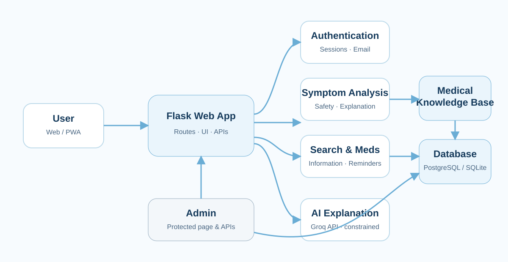

# 🏥 SymptoSense V2

> 📱 **يدعم PWA:** يمكن تثبيت الموقع على شاشة iPhone وAndroid كتطبيق من الرابط نفسه. راجعي [دليل النشر والتثبيت](./DEPLOY_GUIDE_AR.md).

> 🔐 **حسابات آمنة:** فحص الأعراض والبحث عن الأدوية متاحان دون حساب، بينما تتطلب تذكيرات الأدوية وملفات العائلة تسجيل الدخول حتى تبقى البيانات مرتبطة بصاحبها ومتاحة على أجهزته. بعد تسجيل الدخول يفتح الملف الصحي الخاص مباشرة ويعرض الأعراض السابقة والأدوية والحساسية والحالات الصحية وفحوصات الدم والعائلة. الضغط على اسم المستخدم يفتح الملف الشخصي، والسهم المجاور له يعرض خيارات الحساب فقط.

> 🌐 **اختيار لغة واضح:** رابط الموقع الأساسي وفتح التطبيق يعرضان شاشة عربية/إنجليزية محايدة أولًا. يُحفظ الاختيار على الجهاز، ويمكن تغييره لاحقًا من داخل الموقع.

> 📐 **متجاوب مع جميع المقاسات:** شريط كامل للكمبيوتر، ورأس مختصر مع تنقل سفلي للآيباد والجوال، وبطاقات ونماذج ومحادثة تتكيف تلقائيًا من الشاشات الصغيرة حتى الشاشات الكبيرة.

**بوت تيليجرام ذكي لتحليل الأعراض الصحية وتوعية المستخدمين — مبني بلغة Python، يجمع بين نموذج لغوي كبير (LLM)، نموذج تعلم آلة مدرّب محلياً، وبيانات مجتمعية حية.**

> ⚠️ هذا المشروع لأغراض التوعية والتعليم فقط، ولا يُغني عن استشارة طبيب مختص.

---

## 📐 مخطط النظام (Architecture)



---

## ✨ الميزات

| الميزة | الوصف |
|---|---|
| 🧠 **تحليل مدعوم بقاعدة معرفة** | يطبّع الأعراض، يسترجع العلاقات والمصادر الموثقة، يطبق قواعد الأمان، ثم يستخدم Groq لشرح النتيجة فقط |
| 💬 **شخصية تفاعلية** | كل رد يتضمن ملاحظة شخصية متعاطفة مبنية على حالة المريض تحديداً، مو نصوص جاهزة |
| 🕐 **ذاكرة عبر الوقت** | يقارن كل تحليل جديد بآخر زيارة لنفس المستخدم (تغير الشدة، تكرار الأعراض) |
| 📊 **رادار الأعراض المجتمعي** | إحصائيات حية (نص + رسم بياني) لأكثر الأعراض المُبلّغ عنها خلال آخر 7 أيام، من كل المستخدمين (بيانات مجهولة الهوية) |
| 🤖 **نموذج تعلم آلة حقيقي** | مصنّف Bernoulli Naive Bayes مدرّب على بيانات أعراض، يعطي احتمالات حقيقية لكل حالة (دقة اختبار: 65.3% — التفاصيل في [MODEL_CARD.md](./MODEL_CARD.md)) |
| 🏥 **إيجاد أقرب مستشفى** | بالحالات عالية الخطورة، يطلب موقع المستخدم (اختيارياً) ويبحث عن أقرب المستشفيات عبر OpenStreetMap |
| 🌙 **وعي بالوقت والعمر** | يراعي وقت الليل (نصائح راحة بدل الحث الفوري على الخروج) والفئة العمرية (طفل / مراهق / بالغ / كبير سن) بصياغة الرد |
| 💬 **أسئلة متابعة** | بعد كل نتيجة، يقدر المستخدم يسأل أسئلة حرة مبنية على حالته بالضبط |
| 📦 **تصدير بيانات** | أمر إداري `/export` يرسل كل البيانات المجهولة كملف Excel جاهز لـ Power BI |
| 📈 **إحصائيات استخدام** | أمر إداري `/stats` يعرض عدد الزوار والتحليلات المكتملة |
| 🌐 **ثنائي اللغة** | يدعم العربية والإنجليزية بالكامل |
| 🎨 **هوية بصرية موحّدة** | جميع الصفحات تستخدم الأزرق الطبي والكحلي والخلفيات الفاتحة والنصوص الواضحة، مع تخصيص ألوان الخطر والتنبيه والنجاح للحالات الطبية فقط |
| 💙 **صفحة من نحن** | صفحة مستقلة على `/about-us` تعرض كلام ريماس حميد السلمي كاملًا بجانب صورة الهاتف الصحية الأصلية، مع رابط Telegram الكامل وتصميم متجاوب بالعربية والإنجليزية |
| 👤 **ملف صحي خاص** | ملخص متجاوب للحساب يعرض آخر الأعراض، التحليلات، الأدوية، الحساسية، الحالات الصحية، فحوصات الدم وملفات العائلة من دون خلط سجلات الأشخاص |
| 📊 **لوحة إدارة محمية** | إحصائيات الاستخدام وقاعدة المعرفة والأمراض والأعراض والعلاقات والمصادر وعلامات الخطر وسجل التعديلات وصحة النظام |

---

## 🧠 Medical Knowledge Base

التقييم في نسخة الويب يعمل بهذا الترتيب:

`User Input → Symptom Normalization → Knowledge Retrieval → Disease/Symptom Matching → Rule-based Safety → AI Explanation → Risk Level → Sources & Next Steps`

- قاعدة بيانات منظمة للأمراض والأعراض والعلاقات والمصادر وقواعد الخطر.
- تطبيع عربي/إنجليزي للمرادفات مثل «راسي يعورني» و`head pain` إلى `Headache`.
- مطابقة قابلة للتفسير تعرض: توافق مرتفع / متوسط / منخفض من دون نسب إصابة.
- طبقة أمان مستقلة عن الذكاء الاصطناعي توقف عرض الاحتمالات عند علامة خطر عاجلة.
- لا يظهر المحتوى `Draft` أو `Disabled` للمستخدم، ولا تدخل المطابقة إلا الأمراض النشطة ذات المصادر النشطة والموثقة.
- التحقق من روابط المصادر يفرض HTTPS ونطاقات الجهات الطبية المسموح بها.
- كل تعديل إداري يُسجّل في Audit Log، مع Version History للأمراض والأعراض والمصادر وقواعد الخطر.
- البيانات الابتدائية (5 أمراض، 29 عرضًا، 6 جهات مصدر) مجموعة بداية قابلة للتوسعة من `/admin`، وليست موسوعة طبية كاملة.
- قاعدة المعرفة تخزن محتوى طبيًا عامًا فقط ولا تحتوي أسماء مرضى أو هواتف أو بريدًا أو محادثات شخصية.

الـAI لا يحدد مستوى الخطورة ولا ينشئ قائمة الأمراض أو الروابط؛ هذه الحقول تأتي من قاعدة المعرفة وقواعد الأمان، ويقتصر دوره على الشرح المبسط ضمن السياق المسترجع.

---

## 🗂️ هيكل الملفات

```
SymptoSense/
├── bot.py                  # نقطة الدخول الرئيسية — منطق المحادثة وكل الميزات
├── db.py                   # طبقة قاعدة البيانات (SQLite) — سجلات، زيارات، اتجاهات
├── medical_knowledge.py    # مخطط قاعدة المعرفة، التطبيع، المطابقة، الأمان، التدقيق والإصدارات
├── platform_v2.py          # التحليلات المجهولة وإدارة المحتوى والأمان وسجل نشاط الإدارة
├── admin_operational.py    # Drop-off وLive Activity وتقرير Medication Analytics المجهول
├── medication_push.py      # Medication Reminders وWeb Push الآمن
├── push_worker.py          # Worker مستمر لإرسال Push من الخلفية
├── analysis_core.py         # تسلسل التحليل ودمج قاعدة المعرفة مع الشرح بالذكاء الاصطناعي
├── dashboard.py             # لوحة الإدارة الموحدة ثنائية اللغة
├── webapp.py                # الواجهة والمسارات وواجهات API العامة والإدارية
├── ml_diagnosis.py          # استدلال نموذج تعلم الآلة (بايثون خالص، بدون scikit-learn وقت التشغيل)
├── ml_model.json            # معاملات النموذج المدرّب (مُصدَّرة من train_model.py)
├── train_model.py           # سكربت تدريب النموذج (scikit-learn) — يُشغَّل مرة واحدة أوفلاين
├── geo_hospitals.py         # البحث عن أقرب مستشفى عبر OpenStreetMap Overpass API
├── requirements.txt         # مكتبات Python المطلوبة
├── MODEL_CARD.md             # توثيق رسمي لنموذج تعلم الآلة (البيانات، التقييم، الحدود)
└── README.md                 # هذا الملف
```

---

## ⚙️ الإعداد والتشغيل

### تشغيل موقع الويب

```bash
pip install -r requirements.txt
python webapp.py
```

بعد التشغيل افتحي `http://localhost:5000`. ملفات PWA (`manifest.webmanifest` و`service-worker.js` والأيقونات) تُخدّم من المسار الرئيسي تلقائيًا.

### المتغيرات البيئية المطلوبة

| المتغير | الوصف |
|---|---|
| `TELEGRAM_BOT_TOKEN` | توكن البوت من [@BotFather](https://t.me/BotFather) |
| `GROQ_API_KEY` | مفتاح API من [console.groq.com](https://console.groq.com) |
| `ADMIN_TELEGRAM_ID` | معرّف تيليجرام الرقمي للمشرف (لأوامر `/stats` و `/export`) |
| `DB_PATH` | مسار قاعدة البيانات (استخدمي مساراً على Volume دائم بالإنتاج، مثل `/data/symptosense.db`) |
| `HASH_SALT` *(اختياري)* | نص عشوائي لتقوية تجهيل هوية السجلات الصحية في قاعدة البيانات |
| `WEB_SECRET` | قيمة عشوائية طويلة وآمنة لجلسات تسجيل الدخول وCSRF |
| `ADMIN_EXPORT_PSEUDONYM_SECRET` *(موصى به)* | مفتاح HMAC ثابت وعشوائي لتوليد المعرّفات المستعارة في ملفات Admin Excel بدون كشف User ID الحقيقي |
| `CONSENT_HASH_SECRET` *(موصى به)* | مفتاح ثابت وعشوائي لمعرّفات سجلات الموافقة المجهولة |
| `ANALYTICS_SESSION_SALT` *(موصى به)* | Salt ثابت وعشوائي لمعرّفات جلسات التحليلات التشغيلية المجهولة |
| `SYMPTOSENSE_ADMIN_EMAIL` *(قديم/غير مستخدم لتغيير المالك)* | يتم تجاهل أي قيمة متعارضة؛ حساب Admin المثبت في هذه النسخة هو `remasalsolami2020@gmail.com` فقط. |
| `ADMIN_AUTH_DEBUG` *(اختياري)* | `1` أثناء اختبار Admin لإظهار سجلات تشخيصية غير حساسة، ثم `0` بعد التحقق. |
| `BREVO_API_KEY` | مفتاح API v3 صالح من Brevo لإرسال Email Verification وروابط الاستعادة |
| `BREVO_FROM_EMAIL` | بريد Sender حالته `Verified` داخل Brevo (مثل `remasalsolami1@gmail.com`) |
| `BREVO_FROM_NAME` | اسم المرسل الظاهر، مثل `SymptoSense` |
| `SITE_URL` | رابط الموقع العام المستخدم داخل رسائل التحقق والاستعادة؛ في Railway يمكن استنتاجه من `RAILWAY_PUBLIC_DOMAIN` |
| `SESSION_COOKIE_SECURE=1` *(للإنتاج)* | إرسال ملف جلسة الدخول عبر HTTPS فقط |
| `ALLOW_SQLITE_FALLBACK` *(تطوير فقط)* | اتركيه غير موجود أو `0` في Railway؛ القيمة `1` تسمح بقاعدة محلية مؤقتة عند فشل PostgreSQL ولا تصلح للإنتاج |
| `MEDICAL_SOURCE_ALLOWED_DOMAINS` *(اختياري)* | نطاقات موثوقة إضافية، مفصولة بفواصل؛ الافتراضي يسمح بالجهات الطبية الرسمية المضمنة فقط |
| `VAPID_PUBLIC_KEY` / `VAPID_PRIVATE_KEY` / `VAPID_CLAIMS_EMAIL` | مفاتيح Web Push لتذكيرات الأدوية الخلفية |
| `ANALYTICS_PRIVACY_THRESHOLD` *(اختياري، الافتراضي 5)* | الحد الأدنى لحجم المجموعة قبل إظهار تفاصيل Medication Analytics |
| `PUSH_WORKER_MODE` *(اختياري، الافتراضي `embedded`)* | `embedded` لتشغيل الجدولة داخل خدمة الويب نفسها، أو `external` عند استخدام Worker مستقل مع قاعدة مشتركة |
| `PUSH_WORKER_INTERVAL_SECONDS` *(اختياري، الافتراضي 20)* | معدل فحص Worker للتذكيرات (15–60 ثانية) |

استخدمي حساب المالكة الموجود بالفعل وسجّلي الدخول به، ثم افتحي `/admin`. الخادم يتحقق من صف الحساب الحالي في قاعدة البيانات ويصلح دوره إلى `admin` عند تطابق حساب المالكة الموجود؛ لا ينشئ مستخدمًا بديلًا ولا يخزن كلمة مرور في الكود. لا توجد واجهة للمستخدم العادي لتغيير الأدوار، وكل حساب جديد يبقى `role = user`. راجعي `ADMIN_SETUP.md`.

### واجهات قاعدة المعرفة

واجهات القراءة العامة: `/api/diseases` و`/api/symptoms` و`/api/sources`، مع صفحات التفاصيل والمصادر المرتبطة. واجهات `/api/admin/*` محمية بالجلسة والدور وCSRF، وتشمل CRUD والعلاقات وعلامات الخطر والتدقيق والإصدارات وصحة النظام.

### التشغيل محلياً

```bash
pip install -r requirements.txt
python bot.py
```

### النشر (مثال: Railway)

1. اربطي المستودع بمشروع Railway
2. أضيفي المتغيرات البيئية أعلاه من تبويب Variables
3. أرفقي **Volume** بمسار `/data` لضمان بقاء البيانات بين عمليات النشر
4. Railway ينشر تلقائياً عند أي `git push`

---

## 🤖 عن نموذج تعلم الآلة

مصنّف **Bernoulli Naive Bayes** مدرّب على بيانات اصطناعية مبنية على قاعدة معرفة طبية منسّقة (15 حالة شائعة، 12 عرض). التفاصيل الكاملة (منهجية البيانات، جدول التقييم الكامل لكل حالة، القيود، الاعتبارات الأخلاقية) موثّقة في [MODEL_CARD.md](./MODEL_CARD.md).

لإعادة تدريب النموذج:
```bash
python train_model.py
```

---

## 🔐 الخصوصية

- لا يتم تخزين أي هوية حقيقية — معرّف كل مستخدم يُحوَّل إلى **hash أحادي الاتجاه** قبل التخزين
- بيانات "رادار الأعراض المجتمعي" مجمّعة وغير قابلة لربطها بشخص معين
- مشاركة الموقع (لإيجاد أقرب مستشفى) اختيارية بالكامل ومستخدمة فقط لحظياً، غير مخزّنة

---

## 👤 عن المشروع

بُني بواسطة **ريماس السلمي** كمشروع يجمع بين تطوير البرمجيات وعلوم البيانات — من جمع البيانات وتدريب النموذج إلى النشر الإنتاجي الكامل.

للتواصل: [https://t.me/rms_2o](https://t.me/rms_2o)


### True Medication Web Push

راجع `RAILWAY_PUSH_SETUP.md`. الوضع الافتراضي `embedded` يعمل داخل خدمة الويب نفسها ومناسب للنشر الحالي ذي SQLite؛ ويمكن استخدام `push_worker.py` كخدمة مستقلة عند الانتقال إلى قاعدة مشتركة مثل PostgreSQL.
